# 一、类型名为str  
## 1、python只有字符串、不单独有字符  
使用 单引号 或 双引号 包含的都是字符串  

## 2、字符串运算：加法(拼接) 和 乘法  
举例：  
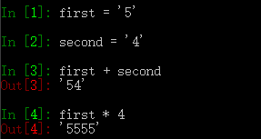  
如果需要、你可以加上空格: first + ' ' + second  

## 3、多行的文本、可以使用三重引号：  
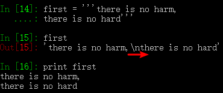  
注意到其中first 是包含了一个换行符，使我们输入时使用Enter键输入的。  
在使用print 函数打印时、这个换行符'\n' 才会显现出来。  
而在first 本体中、他仍然是一个字符(或者说是一个十六进制数)。  

## 4、str 也可以进行切片操作
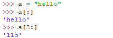  

# 二、字符串处理
## 分解字符串
* .split(str)  
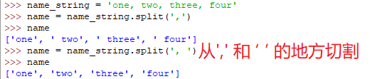  
还可以按单词切割  
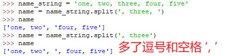  
但有多个分割符(逗号、空格等)时的切割就要麻烦些  
如果不指定.split(str)中的str、就默认str 为空白符  

## 连接字符串
* join(list)  
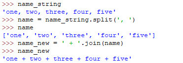  
用字符串' + '连接name 这个list 的每个元素，得到一个新的字符串  
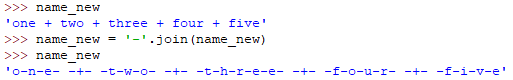  
这里连接的是一个字符串，字符串的每个元素就都是一个字符，结果就是每个字符都用'-' 连接起来  

## 搜索字符串
* .startswith(str)  
得到以某几个字符(包含在str 里面)开头的字符串  
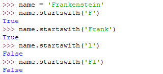  
这使得我们可以在一个文本中找到以str 开头的部分  

* .endswith(str)  
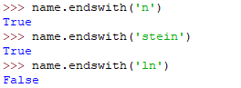  

## 查找子串的位置
* in 关键字  
子串是否在该字符串中  
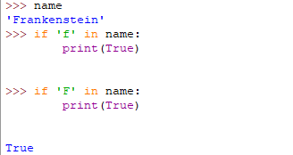  

* .index(str)
子串在字符串中的位置(如果存在)  
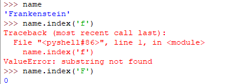  
要避免出错误提示、需要使用in 关键字先确认子串str 是否在该字符串中存在  

## 删除末尾的子串
* .strip(str)  
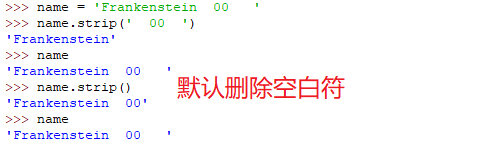  
结果是创建了一个新的字符串、原来的字符串未被修改  

## 大小写转换
* .lower()  
* .upper()  
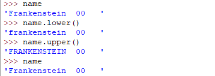  
仍然是创建了一个新的字符串、原来的name 这个名字/标签 仍旧在原来的字符串 上面  
这可以让我们笔记两个字符串是否相同：  
* 1、全部转换为大小 或小写  
* 2、笔记这两个字符串  
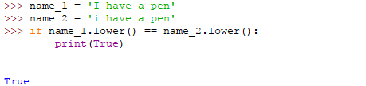  