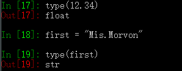

# 一、python的数据类型
基本类型：
* str
* int
* float
 使用type()可以查看一个对象的类型： 
   

# 二、类型转换
类型转换的实质： 
* 创建了一个新的对象、它根据原来的对象及需要的类型进行转换而来 
* 原来的对象还在 
 
# 三、常用函数
function     | usage
------------ | -------------
float()      | 将 str/int 转化为 float
int()        | 将 str/float 转化为 int
str()        | 将 int/float 转化为 str
 