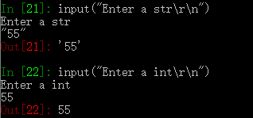

# 一、输入
* Python2 支持input 和raw_input
* Python3 支持input、 raw_input已经被删除
* 都可以输出提示信息、如input("Enter something \r\n")

## raw_input (Python2)
* 用于接收一个str 
 

## input (Python2)
* 用于接收数据(int、float、str)
* 所以如果是str、需要加引号： 
 

## input  (Python3)
* 用于接收一个str 
 