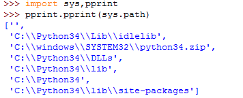

# 一、安装easygui
* 到[http://easygui.sourceforge.net](http://easygui.sourceforge.net) 下载easygui，拿到easygui.py：  
   

* 在python 里面使用pprint 找到python解释器从哪个路径去search & import 一个模块：  
   

* 将easygui-0.97.zip 里面的东西解压到任一个路径里面均可，这里我解压到site-packages 目录。  
* 这样、在python解释器里面就可以import easygui 模块了：  
   
运行效果如下：  
  
用户点击了"OK"按钮之后、这个对话框会向python解释器返回一个str = 'OK'  

# 二、组件
## msgbox
效果如上图  
## buttonbox  
使用这两个组件可以实现按钮输入与信息输出：  
```javascript
import easygui
flavor = easygui.buttonbox(msg = "What is your favorite ice cream flavor?",
                           title = "ice cream",
                           choices = ("Vanilla", "Chocolate", "Strawberry"))  # 元组
easygui.msgbox("You picked" + flavor)
```
效果：  
  

## choicebox
```javascript
import easygui
flavor = easygui.choicebox(msg = "What is your favorite ice cream flavor?",
                           title = "ice cream",
                           choices = ["Vanilla", "Chocolate", "Strawberry"])  # 列表
easygui.msgbox("You picked " + flavor)
```
效果：  
  

## exterbox
```javascript
import easygui
flavor = easygui.enterbox(msg = "What is your favorite ice cream flavor?", 
                          title = "ice cream",
                          default ="orange")
easygui.msgbox("You picked " + flavor)
```
效果：  


# 三、修改组件
* 修改选择框的尺寸
* 在easygui.py 模块里面的def __choicebox，修改下面的系数(0.8 和0.5)即可：  
```javascript
    root_width = int((screen_width * 0.8))
    root_height = int((screen_height * 0.5))
```
