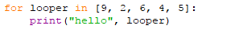
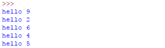
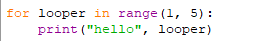
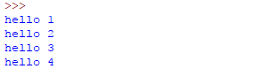
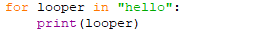
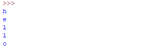

# 一、for循环  
## 1、列表
  
* for 循环里面使用了列表，从第一个元素开始、循环变量looper 会被依次赋值为列表中的每一个值。  
结果：  
  
* 循环的次数 = 列表元素的个数  
* 每次循环 成为 一次迭代  
* 循环变量不需要事先定义  

## 2、range()
* range(k, n) 用来创建列表为：[k, k+1, k+2, ... , n-1]  
  
正好可以用在循环中：  
  
* range(0, n) 可以简写为range(n)  

## 3、字符串
* 字符串类似一个列表、也可以用在循环中：  
  
* 循环变量也会被依次赋值为字符串中的每一个元素  
  