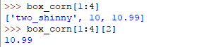
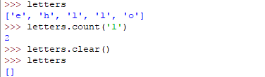

# 一、列表

## 用途：
* 用于存储一组对象
* 列表内的元素的类型可以不一样，如：  
  


# 二、基本操作

## 1、创建列表
```javascript
box_corn = []
```

## 2、列表是有序表
## 3、两个列表之间是可以互相比较、相加的
* 示例  
  

* python 的变量是一种标签，所以两个变量的赋值会倒置两个变量指向同一个内存  
也就是说、我们可以使用任何一个名字、任何一个指向该内存的标签(变量)来进行操作  
结果是、修改了一个变量、另一个也会被修改  
  


## 2、添加元素
### 在末尾追加一个元素
* .append(object)  
  
由于列表的元素的类型可以不一样，所以列表内可以存储它自身：  
  

* 访问列表中指定的元素：box_corn[index]
由于可以存储列表自身、这使得我们可以无尽头的取一个元素(box_corn[2])：  
  

### 在末尾追加多个元素
* .extend(iterable)  
  
我们可以使用.append() 增加一个列表，但他是一个元素：  
  
这就是和.extend() 不一样的地方  


### 在指定的位置index添加一个元素
* .insert(index, object)  
  


## 3、切片操作(slicing)
* 得到列表的一部分  
取出第1-3 个元素：box_corn[1:4]、我们将得到一个新的列表：  
  
和range(k, n) 一样、末尾取的是开区间：[k, n)  
由于得到的是一个新列表、所以列表的操作也是适用于它：  
  

* 向后切片、得到后一部分  
  

* 向前切片、得到前一部分  
  
留意到仍然是祖传的末尾开区间特性[k, n)  

* 完全切片、到整个列表  
  

## 4、修改元素
* box_corn[index] = new_thing  
  
可以看到、box_corn 里面包含的那个box_corn自己 的那个元素也被修改了  
也可以由box_corn 里面包含的那个自己来修改自己。。。。。  
__反正都是box_corn 它自己、而不是一个新的列表__  


## 5、删除元素
### 使用元素的值
* .remove(value)  
  
value 必须是列表中具体的元素的值、而不需要知道这个元素在那个位置index  
如果有重复的value、它只会删除最前面的一个  
  

### 使用元素的位置index
* .pop(index)  
  
这里就是使用了元素的位置index  
同时.pop()还返回了这个元素的值、相当于是取出这个元素(并删除)  
如果不指定具体的位置index、就默认从末尾取出(并删除)  

### 使用元素的位置index
* del 指令  
  
可以删除指定元素(包括切片选中的part)  


## 6、搜索元素
### 元素是否在列表中
* in 指令  
  
它返回一个布尔表达式的结果  

### 元素在列表中的那个位置index
* .index(value, start, stop)  
  
它返回一个数值index  
如果有重复的元素、它只会返回第一个发现的位置index  

## 7、排序 .sort()、.reverse()
* 由于列表是有序表、所以会需要排序功能  

* .sort(key, reverse = False) 按字母、数字大小正序排序  
  

* .sort(key, reverse = True) 按字母、数字大小逆序排序  
  

* .reverse() 倒置列表  
  
有了倒置、还可以和.sort()配合实现逆序排序  

* 如果需要保留原来的列表、只是想生成一个新的已排序列表，需要使用完全切片、以得到一个副本  
  
因为切片操作得到的也是一个列表、所以列表的这些排序操作当然也可以用啊  
但是.sort()没有返回值，使用绿色框内的操作是得不到任何结果的  
不可以使用'=' 赋值来创建副本、因为python的变量只是标签、使用哪个变量名进行操作都可以  
切片操作得到副本、再使用副本去操作、原来的列表才不会被修改：  
  

* 对单词的排序 = 按第一个字母进行排序  
  
第一个字母相同、则比较第二个，以此类推

## 8、创建副本 .copy()
* .copy()  
  

## 9、元素个数 .count()
## 10、清空列表 .clear()
* .count(value)  
* .clear()  
  


# 三、双重列表
* 由于列表的元素可以是任何类型、所以当然可以是列表  
* 一个列表的元素都是列表、这个列表就是双重列表  
  

* 访问方法和操作与普通列表一样  
  
