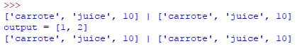

# 一、函数的构成
## 1、参数
* 参数和python 的普通变量一样、也是标签，形参可以接收任何类型  
  
结果：  
  

* 如果参数太多、可以把它们打包在一个列表里面传进来  

## 2、返回值
* return  
  
返回值较多、也可以打包成列表返回  

## 3、参数的作用域
* 函数内部的参数是局部变量、在函数开始时被创建、函数结束后被销毁  
* 全局变量在函数内部可以被读取  
  

* 但无法被函数修改  
如果在函数内部修改一个全局变量，python会报错  
  
报错：  
  

* 试图在函数内部修改全局变量、需要使用global 关键字  
  
结果：  
  

## 4、函数传入的列表list 和字典dict 可以被修改、而不必使用global关键字  
* food在函数中使用了列表操作、本身会被当做全局变量去修改  
  
结果：  
  

* 而这样的用法、是一条定义语句、定义了一个局部变量，而全局变量未被修改  
  
结果：  
  
要使用global 关键字才可以使用这种修改方式：  
  
结果：  
  
全局变量food 被修改了、也就是food 这个标签从原来的列表上移到了新的列表  
而原来的列表不变  

# 二、操作建议
* 所有变量(局部 and 全局)在使用前、都定义，而不是直接在第一次赋值时由python自己创建  
* 局部变量 和 全局变量 的名字不要一样、避免混淆
* 函数内部 的 全局变量 全部加global 关键字、不论是否可修改  
示例：  
  
