# 一、对象
* 函数可以把 代码 汇集到一起
* 对象可以把 函数 和 数据(数、字符、列表、...) 汇集到一起

* __类的最大特点就在于实现了数据(变量)的封装(与隐藏)__  

## 1、对象 = 属性 + 方法(操作)
* 属性 attribute ：尺寸、大小、颜色    --    数据
* 方法 method    ：拿起、关闭、放大    --    函数

## 2、object = object.attribute + object.method

# 二、创建对象
## 1、类 class
* class = 一个对象的蓝图

## 2、实例 instance
* instance = 由class 蓝图创建出来的实体(对象)

## 3、示例
* 初版  
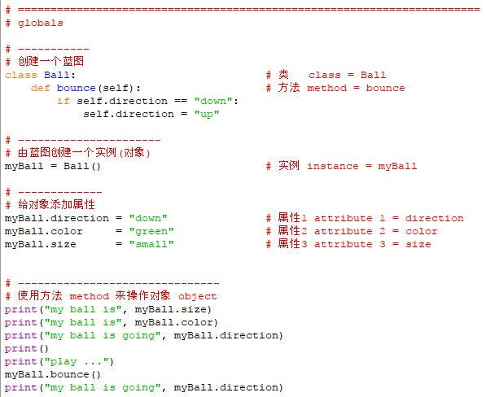  
这个对象的属性并没有在创建蓝图的时候定下来
而是在创建了实例(对象)之后才定下来  

* 标准方式  
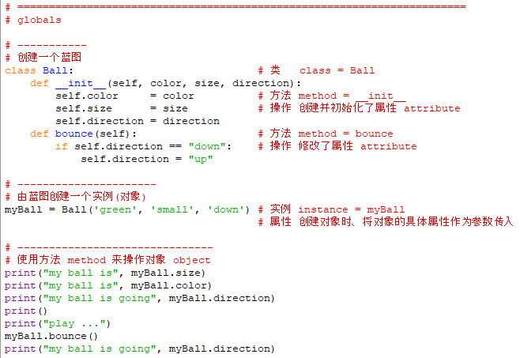  
默认使用__init__()方法来创建并初始化蓝图中的属性(数据)  
结果：  
  
其中、__init__方法可以只写self，只不过这样的话、在创建对象时就不能初始化了  
但有时、所有对象都是一样的初始状态、就可以只写self：  
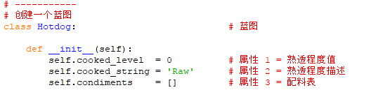  
在具体的方法中使用/修改这些属性数据即可  

* 使用__str__()  
如果打印一个蓝图、实例会得到如下默认信息：  
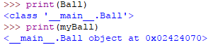  
加入__str__方法可以让一个实例(对象)自定义这些信息  
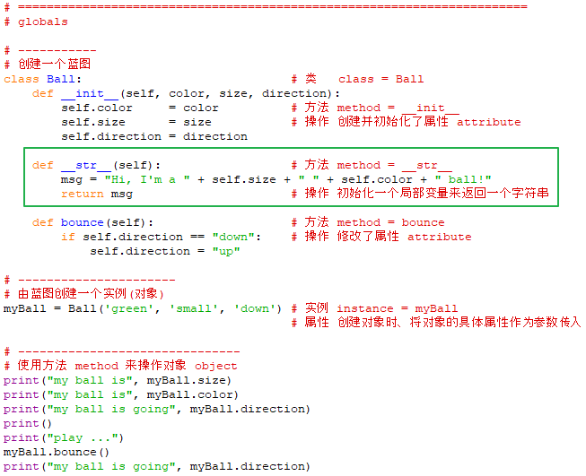  
打印对象自定义的信息：  
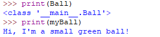  
这样、以后每次更新了属性数据之后、都可以再次打印新的对象信息了  
因为__str__()方法里面调用了属性信息数据  

* 数据(属性 instance)  
属性数据可以是任何一种变量，包括list等  
又由于python 的变量只是标签、所以一个属性数据的类型还是可以变化的  
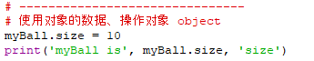  
  

# 三、实例引用 instance reference (self)
* 创建多个对象  
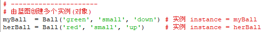  
此时调用方法时、蓝图中的self 参数就会告知蓝图的方法、到底是那个对象在调用它  
(myBall.bounce() 在后台会变成 Ball(myBall)，对象名myBall 就是这样默认地通过self 传入的)  
这就是self 的作用、也是一个蓝图可以创建多个对象的基础  
这个过程称为实例引用 instance reference  

* 每个对象都有自己的一块place (内存)  
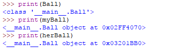  
蓝图自己也有自己的一块place (内存)  
加入__str__()后的实例信息：  
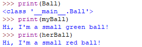  

# 四、隐藏数据
* 通常不直接访问属性数据、而是只通过方法来操作属性数据  
这样可以保证数据不会被意外修改  

# 五、多态 polymorphism | 继承 inheritance
## 1、多态
* 对于不同的类 class、可以有同名的方法 method  
它们之间互相独立、互不干涉  
例如、又有一个类 class Vegetable：  
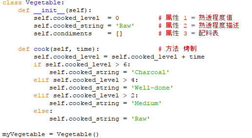  
它也有.cook()这个方法  
但操作Vegetable.cook() 和 Dog.cook() 是两个不同的方法，结果也不一样：  
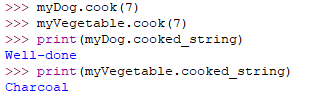  

## 2、继承
* 一个类 class 可以从 另一个类 class 继承一些属性数据和方法：派生类 derived class | 子类 subclass
这样可以共用一些属性和方法、不需要重复定义
同时、共同的属性变化之后、或共同的方法运行以后，会影响到所有的子类  
* 这种创建了共同属性和方法、专用来给其他类 class 来继承的类 class：原始类  
例如、有一个游戏，定义一个拥有共同属性和共同方法的类：  
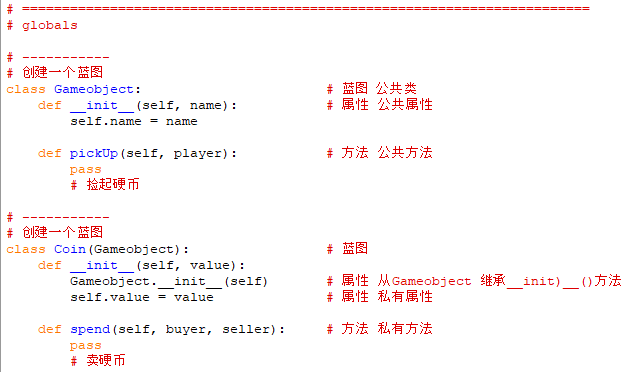  
* 继承的语法：  
1、class Coin(公共类名)  
如果是从其他模块继承公共类、语法为：class Coin(ModuleName.公共类名)  
2、子类调用公共类的方法时、需要使用公共类的类名、同时带上self 参数、在传入公共类的方法需要的其他参数  

* 有相同继承关系的这些类同属一个家族  
* 虽然每个子类都是用同样的属性和方法，但各子类在使用它们时会包含self 参数，这会让公共类的属性和方法知道到底是那个子类在调用它们  

* 继承是实现代码复用的途径  

* 示例代码(14-101-bankaccount.py)：  
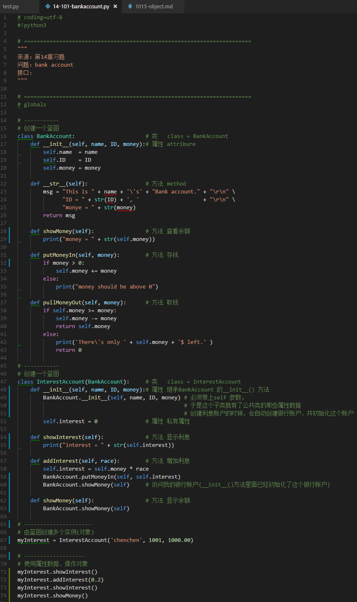  
运行结果：  
  

# 六、代码桩 code stub
* 空函数、空方法，先占位待以后根据需求填充  
* 为了使用自上而下的开发方法？  
* 使用pass 关键字来作为一个占位符、避免出现python不允许的空函数  