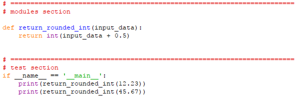
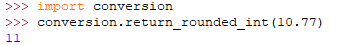
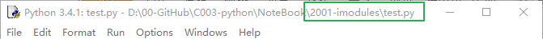
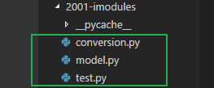
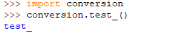
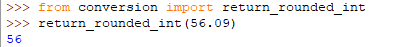

# 一、模块
* 一个模块就是一个文件  

## 1、\_\_name\_\_
* import  
  
使用了模块的内置属性 \_\_name\_\_，在直接运行模块时，就可以运行 test section  
而在import 这个模块时、就不会运行test section

* '\_\_main\_\_'  
在cmd 或python shell 中直接运行module.py 时、\_\_name\_\_ == '\_\_main\_\_'  
而在import module 时、\_\_name\_\_ == 'module'  
这就是上面的结果的来源  

## 2、调用模块的方式-1
* import  
  
这种方式将特别告知了编译器：这个方法在那个模块  
我们可以使用这个模块内的所有方法  
在python shell 中、如果一个模块没有被放在python 解释器默认的import/search 目录，那么直接import 就会提示找不到它，此时可以用python shell 打开一个该模块所在目录的文件，再去import、就可以了。
如、我打开test.py  
  
再去import 同目录下的conversion 模块  
  
就能成功import 了  
  

## 3、调用模块的方式-2
* from  
  
这种方式则特别强调了加载指定的方法  
不能调用模块内的其他方法，只能调用指定的这个方法  