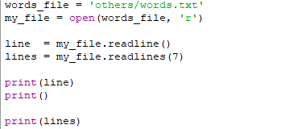
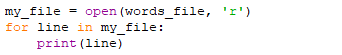
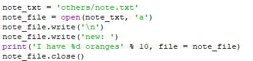
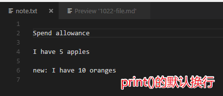
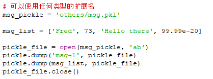
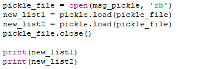
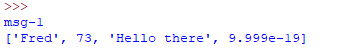

# 一、文件
* 名字
* 类型
* 存储位置
* 大小  

## 路径
* windows里面可以使用正反斜杠 '/'、'\' 来表示路径  
不过要照顾特殊字符、用正斜杠 '/' 会比较好，或者使用两个反斜杠'\\'
* 声音等文件和程序在同一个目录下、程序就可以直接使用文件名来访问这个文件，这是因为程序运行时的'当前工作目录'就是文件所在的目录，程序会默认在它自己的'工作目录'里面去寻找这个文件。

## 文件类型
* 文本文件  
包含字符

* 二进制文件  
不包含字符、没有行的概念

# 二、文件操作
## 打开文件
* open('file name', 'mode')  

mode         | .  | function
------------ | -- | -------------------------
  r          |    | 读
  w          |    | 写、文件不存在就创建文件
  a          |    | 追加、文件不存在就创建文件
  b          |    | 二进制文件

## 关闭文件
* .close()  
关闭文件后、其他程序才可以使用这个文件，否则由于访问冲突的原因、其他程序不能访问这个文件  

## 读文件
* 读一行  .readline()、返回一个str  
          str 不包含换行符'\n'  
          文件行指针自动加1
* 读多行  .readlines(numbers)、返回一个list、每一行都是这个list 的一个元素(str)  
          str 包含换行符'\n'  
          文件行指针自动加1
* 读全部  .readlines()  
  

* readline/s 只能用于读取文本文件

* 文件是一个可迭代的类型  
  
得到的str 不包含换行符'\n'  

## 设置文件指针的位置
* .seek(offset)  

## 写文件
* .write(str)
* print(fmt % (), file = file_object)  
  
使用print() 的优势在于它自带格式处理、可以自动将数据转换为字符  
  

# 三、pickle模块
* 可以将objects 直接存取、而不需要 转换-存储-读出-还原 的过程

## 存储  dump(object, file)
  
python3 以后、都是用二进制格式  

## 还原  load(pickle file object)
  
还原结果：  
  
每次dump进去的作为一个基本单元存储在pickle 文件中  
每次load也是还原一个基本单元  
dump 和load 操作中、文件指针都会自动加1  