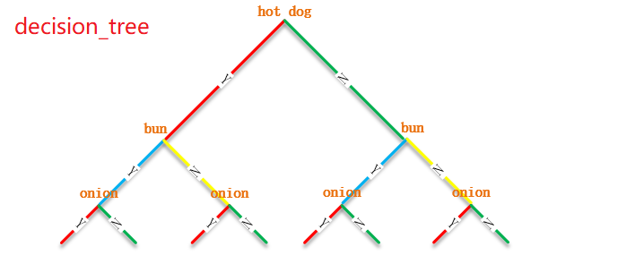
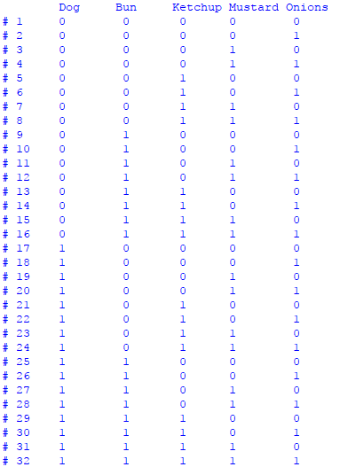

# 一、决策树
## 1、概述
* 用来解决排列组合类问题


## 2、特性
  
* 整棵树由多层的子树构成
* 每个子树 = 1 个决策点 + 2 个分支
* 每个决策点下链接有2 种选择(分支)：Y 和N
* 整棵树的某一路径由相连的子树分支构成
* 每个路径代表1 种排列组合的结果  

## 决策
```javascript
"""
问题：热狗店，提供如下组合：热狗dog、小面包bun、番茄酱ketchup、芥末酱mustard、洋葱onion
     给出所有可能的组合
"""
print("\tDog \tBun \tKetchup \tMustard \tOnions")
count = 1
for dog in [0, 1]:
    for bun in [0, 1]:
        for ketchup in [0, 1]:
            for mustard in [0, 1]:
                for onion in [0, 1]:
                    print("#", count, "\t", end="")
                    print(dog, "\t", bun, "\t", ketchup, "\t\t", end="")
                    print(mustard, "\t", onion)
                    count += 1
```
结果：  
  