# 一、安装pygame
* 到[pygame官网](http://www.pygame.org/download.shtml)下载：  
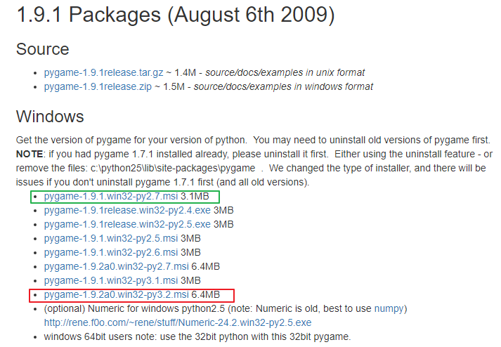  
* 安装过程中会要求选择python 版本：  
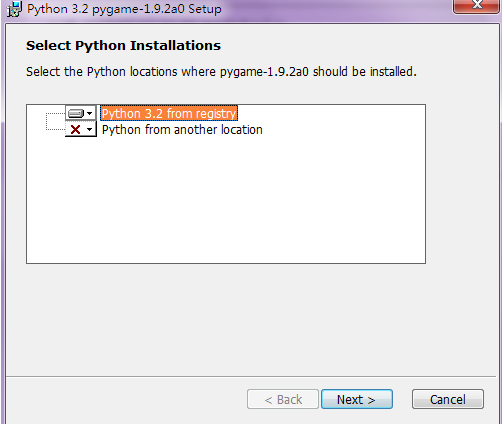  
比如上面绿色框内的pygame版本要求python2.7，而红色框内的pygame版本要求python3.2  
如果版本不对、这一步就不能检测到python，安装后就无法使用  
红色框内的pygame版本要求python3.2、就必须是python3.2，python3.4都不行  
* 提示：  
另外、pygame要求安装新版时必须卸载旧版，而卸载旧版就必须运行旧版的安装程序、选择卸载  
新版安装程序是没有卸载旧版的功能的、只能卸载自己这个版本  
* 安装成功后、import pygame就知道能不能使用了：  
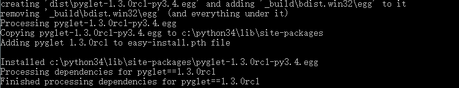  
也可以打卡一个游戏示例(路径：C:\\Python27\\Lib\\site-packages\\pygame\\examples)：  
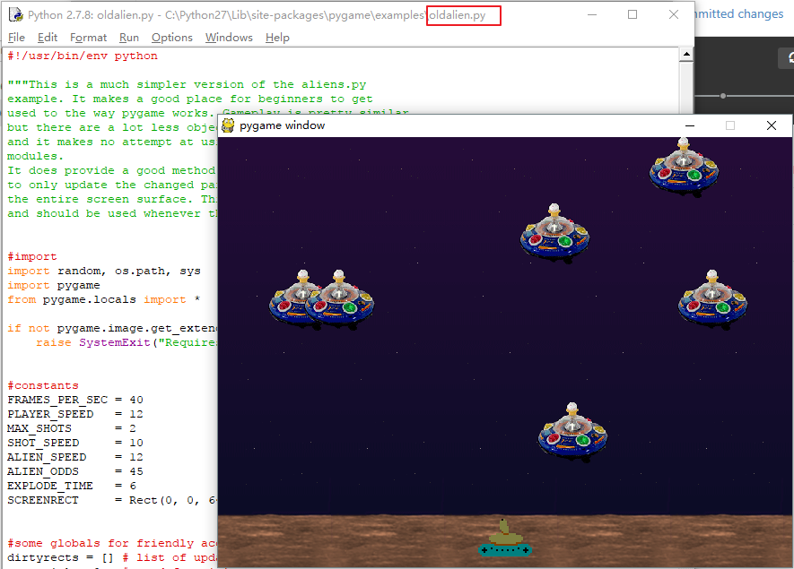  

* 官方文档详见目录：C:\\Python32\\Lib\\site-packages\\pygame\\docs\\ref  

# 二、运行程序
* python shell  
在python shell 运行pygame 代码可能会出现游戏窗口卡死的情况  
这是由于python shell 和pygame 有冲突  
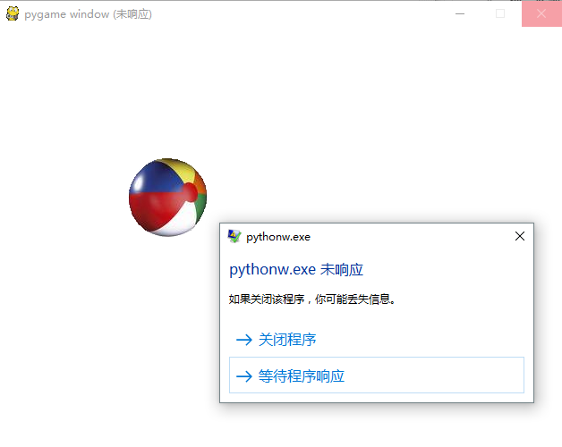  

* cmd  
在cmd 里面调用pygame 代码，就不会有这个问题  
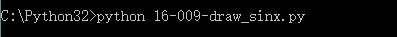  
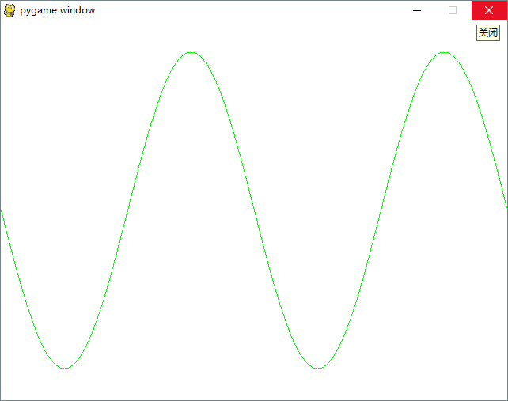  

* 更多内容见官网或help  
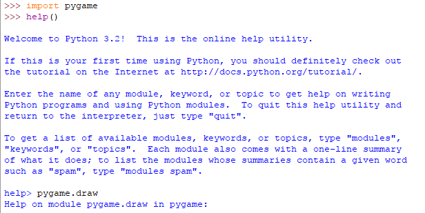  

# 三、常用方法
* pygame.event.get()
* pygame.time.delay(ms)

* screen = pygame.display.set_mode([width, height])
* screen.fill(color[])
* screen.get_width()
* screen.get_height()
* screen.blit(image, [left, top])

* pygame.image.load('location')

* pygame.draw.lines(screen, color[], closed, plotList[], lineWidth)
* pygame.draw.rect(screen, color[], [left, top, width, height], lineWidth)
* pygame.display.flip()

# 四、动画精灵 sprite 
* 作为一个整体单位来进行移动的一组像素称为动画精灵 sprite，是一种图形对象  
* 可以与其他图形对象进行交互  

## 1、sprite 的属性：
* 图像 image：sprite 显示的图片、或pygame 函数等绘制出来的图像  
  * 使用pygame.image.load('location')方法获得  
* 矩形区 rect：包含sprite 的矩形区域、参数就是图像边界  
  * 使用image.get_rect()方法获得  
  * 包含rect.left、rect.right、rect.top、rect.bottom 等属性、表示image 在screen 中的坐标、需要定位/移动image 时使用  
如下面创建了多个动画精灵ball(\\3001-lesson_codes\\17-001-sprite.py)：  
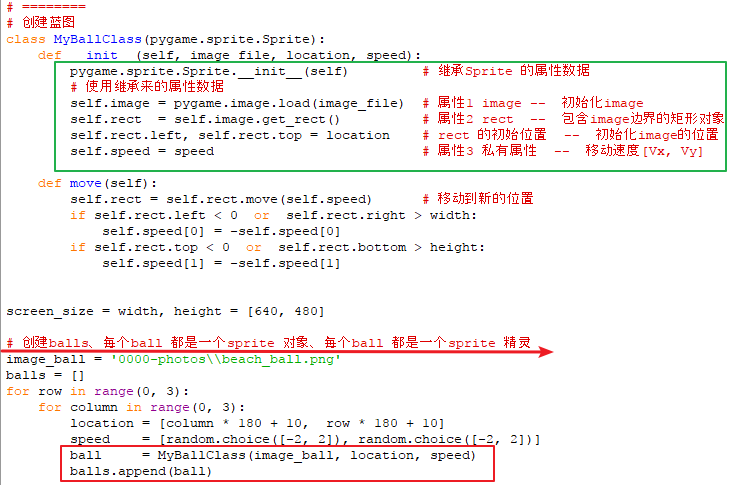  
  * 包含rect.move(speed) 方法来移动图像本身  

## 2、属性数据和方法
* rect.move(speed)

## 3、精灵碰撞检测(矩形碰撞)  --  pygame.sprite.spritecollide(sprite, sprite_group)
* 检测一个精灵与其他精灵是否有碰撞的步骤：  
  * 1、将所有精灵放入一个group
  * 2、将一个精灵从group 中删除
  * 3、pygame.sprite.spritecollide(sprite, sprite_group)
  * 4、将这个精灵放回group
* 如果不将精灵从group 中删除就进行碰撞检测，相当于检测自己与自己是否有碰撞  
重叠也是碰撞、所有结果会返回True  
这在\\3001-lesson_codes\\17-201-ball_shaking.py 中的表现就是精灵们自己震动  

## 4、像素完美碰撞

# 五、帧速率控制
## 1、pygame.time.Clock()类
* clock = pygame.time.Clock()
* clock.tick(frequence)  --  每秒多少次
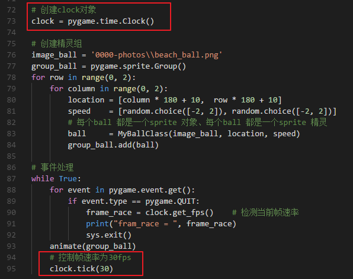  
## 2、Clock.get_fps()方法
* 检查帧速率  

# 六、事件 event
## 1、按键事件
* 详见C:\\python32\\Lib\\site-packages\\pygame\\docs\\ref\\key.html
  
## 2、鼠标事件
* 详见C:\\python32\\Lib\\site-packages\\pygame\\docs\\ref\\mouse.html
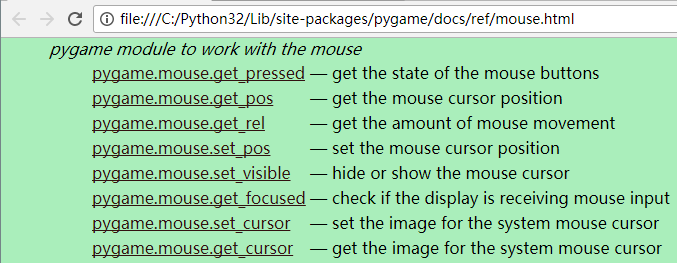  
在移动鼠标时、会得到鼠标的坐标：  
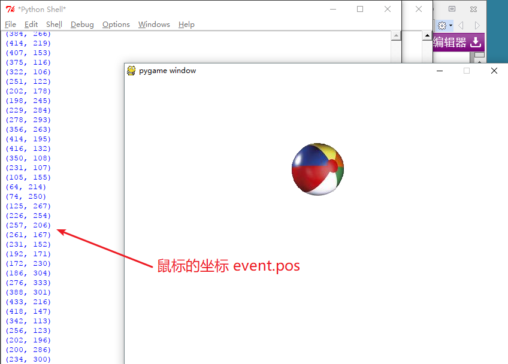  
在\\3001-lesson_codes\\18-001-key_mouse.py 里面会得到ball 跟随mouse 移动的效果(拖拽)  

## 3、定时器事件(自定义事件)
* pygame.time.set_timer(EVENT_NUMBER, interval)  
在interval 时间后、会出一个EVENT_NUMBER事件号、用event.type == EVENT_NUMBER 可以使用它  
使用pygame.USEREVENT 得到第一个用户自定义事件的事件号  
使用pygame.NUMEVENTS 得到事件号的最大值  
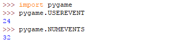  
[USEREVENT, NUMEVENTS]这个范围就是用户可以自定义的事件号范围  

# 七、混音器 mixer
接口参考代码清单18-004-pong.py  